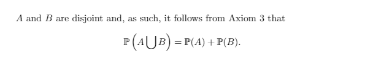

# Chapter 1: Probability
## Solutions
### Exercise 1(a)
Fill in the details of the proof of Theorem 1.8.
 Solution")
### Exercise 1(b)
Prove the monotone decreasing case of Theorem 1.8.
 Solution")
### Exercise 2
Prove the statements in equation (1.1)

### Exercise 3(b)
See text for details.
 Solution")